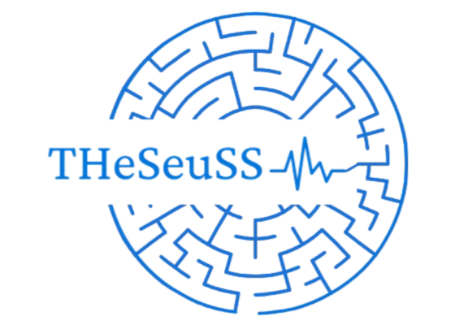

.. These are examples of badges you might want to add to your README:
   please update the URLs accordingly

    .. image:: https://api.cirrus-ci.com/github/<USER>/THeSeuSS.svg?branch=main
        :alt: Built Status
        :target: https://cirrus-ci.com/github/<USER>/THeSeuSS
    .. image:: https://readthedocs.org/projects/THeSeuSS/badge/?version=latest
        :alt: ReadTheDocs
        :target: https://THeSeuSS.readthedocs.io/en/stable/
    .. image:: https://img.shields.io/coveralls/github/<USER>/THeSeuSS/main.svg
        :alt: Coveralls
        :target: https://coveralls.io/r/<USER>/THeSeuSS
    .. image:: https://img.shields.io/pypi/v/THeSeuSS.svg
        :alt: PyPI-Server
        :target: https://pypi.org/project/THeSeuSS/
    .. image:: https://img.shields.io/conda/vn/conda-forge/THeSeuSS.svg
        :alt: Conda-Forge
        :target: https://anaconda.org/conda-forge/THeSeuSS
    .. image:: https://pepy.tech/badge/THeSeuSS/month
        :alt: Monthly Downloads
        :target: https://pepy.tech/project/THeSeuSS
    .. image:: https://img.shields.io/twitter/url/http/shields.io.svg?style=social&label=Twitter
        :alt: Twitter
        :target: https://twitter.com/THeSeuSS

    .. image:: https://img.shields.io/badge/-PyScaffold-005CA0?logo=pyscaffold
        :alt: Project generated with PyScaffold
        :target: https://pyscaffold.org/

|

========
THeSeuSS
========

THeSeuS is a Python package designed to streamline the simulation of IR/Raman and THz spectra. It interfaces seamlessly with electronic structure codes such as FHIaims and DFTB+ for spectrum calculations at both DFT and DFTB levels.

Beyond spectrum calculations, THeSeuS also offers capabilities for computing vibrational frequencies of molecules and phonon modes of periodic systems. Notably, users can opt for structural computations without the additional step of intensity spectrum analysis.

A standout feature of THeSeuS is its full automation. Users can utilize the package for cell/geometry optimizations at the FHIaims or DFTB+ level with minimal manual intervention. By simply providing the experimental structure, THeSeuS automates the generation of input files and other necessary tasks, ensuring efficient and hassle-free simulations.

Acknowledgements
================

