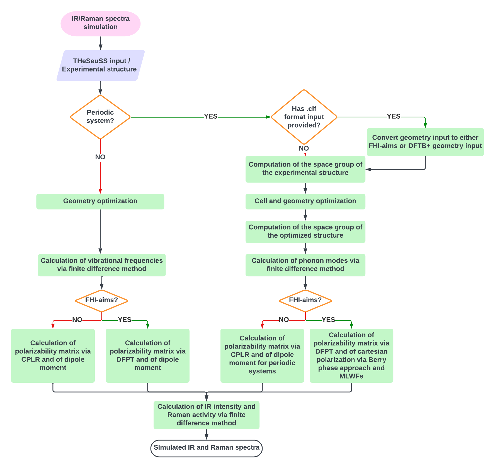

===============
Getting Started
===============

.. |Ang| unicode:: U+00C5
   :ltrim:

Welcome to the introductory ``THeSeuSS`` tutorials.

``THeSeuSS`` consists of the following components:

* **Conversion of experimental geometry input** (for periodic systems only): Converts a .cif format file to either ``FHIaims`` or ``DFTB+`` geometry input files.
* **Space group determination of the experimental or optimized structure** (for periodic systems only)
* **Geometry optimization**
* **Vibrational/phonon frequencies calculations**
* **Property calculations**: polarizability matrix; dipole moment; cartesian polarization (for periodic systems only). 
* **IR intensity and Raman activity calculation**
* **Spectra generation**

The code allows for the execution of all components either simultaneously or individually, based on user preference. 
This option is fully customizable within the ``THeSeuSS`` input file.

Input files
===========

``THeSeuSS`` requires two inputs: the crystal structure and the ``THeSeuSS`` input file.

For the crystal structure, if performing a periodic calculation, you can provide either a ``.cif`` file 
or the geometry input files of ``FHIaims`` (``geometry.in``) or ``DFTB+`` (``geo.gen``).

.. tip::
   If you provide the geometry input files directly, please ensure they are named ``geometry.in`` for ``FHIaims`` or ``geo.gen`` for ``DFTB+``.

The ``THeSeuSS`` input file contains the following keywords:

* ``supercell``: Specifies whether a supercell should be generated during the finite difference method for calculating phonon modes. Set this keyword to ``True`` to create a supercell, or ``False`` if a supercell is not required.
* ``dispersion``: Indicates whether a van der Waals (vdW) dispersion interaction method is applied. Set this keyword to ``True`` to enable the method, or ``False`` to disable it.
* ``cell_geometry_optimization``: Indicates whether cell (periodic only) and geometry optimization is performed. Set this keyword to ``True`` to enable optimization, or ``False`` if not.
* ``submission``: Indicates whether the displaced structures will be generated for the finite difference method used in calculating vibrational frequencies/phonon modes. Set this keyword to ``True`` to enable the generation of displaced structures, or ``False`` to disable it.
* ``files_preparation``: Specifies whether directories for the displaced generated structures will be created to perform calculations for forces, polarizability matrix, and dipole moment (in the periodic case) or cartesian polarization (in the non-periodic case). Set this keyword to ``True`` to generate the directories, or ``False`` to disable it.
* ``spectra_calculation``: Specifies whether to compute frequencies, IR intensities and Raman activities, as well as generate the IR and Raman spectra. Set this keyword to ``True`` to generate the vibrational spectra, or ``False`` to disable it.
* ``code``: If using ``FHIaims``, set this keyword to ``aims``; if using ``DFTB+``, set this keyword to ``dftb+``.
* ``output_file``: The name of the output file associated with the ``FHIaims`` or ``DFTB+`` calculations, as defined by the user.
* ``commands``: The command or commands used to run single point calculations associated with the finite difference method using either ``FHIaims`` or ``DFTB+``. If more than one command is required (e.g., when submitting the ``THeSeuSS`` calculation to a supercomputer), list the commands one after the other, seperated by a semicolon. 
* ``dimensions`` (optional): Specifies the dimensions of the cell or supercell. If ``supercell`` is set to ``False``, use ``1 1 1``, indicating that the cell will not be multiplied in any dimension. If ``supercell`` is set to ``True``, this keyword should define the number of times the cell will be multiplied in each dimension to create the supercell. This keyword is required when performing calculations of a periodic system. 
* ``dispersion_type`` (optional): Specifies the type of vdW dispersion interaction method. For the Tkatchenko-Scheffler method, set this keyword to ``TS``. For the many-body dispersion method, use ``MBDNL`` when using ``FHIaims``, or ``MBD`` when using ``DFTB+``. This keyword must be defined if ``dispersion`` is set to ``True``. 
* ``functional`` (optional): Specifies the functional for Density Functional Theory (DFT). This keyword must be defined when using ``FHIaims``.
* ``eev`` (optional): Convergence criterion for the self-consistency cycle, based on the sum of eigenvalues. This keyword must be defined when using ``FHIaims``.
* ``rho`` (optional): Convergence criterion for the self-consistency cycle, based on the charge density. This keyword must be defined when using ``FHIaims``.
* ``etot`` (optional): Convergence criterion for the self-consistency cycle, based on the total energy. This keyword must be defined when using ``FHIaims``. 
* ``forces`` (optional): Convergence criterion for the self-consistency cycle, based on energy derivatives ("forces"). This keyword must be defined when using ``FHIaims``. 
* ``sc_iter_limit`` (optional): Maximum number of s.c.f. cycles before a calculation is considered and abandoned. This keyword must be defined when using ``FHIaims``. 
* ``species`` (optional): Species defaults settings (basis set, integration grids, accuracy of the Hartree potential). Set this keyword to either ``light``, ``tight``, ``intermediate``, ``non-standard``, ``really_tight``. This keyword is required when using ``FHIaims``. 
* ``energy`` (optional): Energy amount by which a relaxation step can move upwards and is still accepted. This keyword must be defined when using ``FHIaims``.  
* ``geometry`` (optional): Maximum residual force component per atom (in eV/\ |Ang|) below which the geometry relaxation is considered converged (geometry relaxation). This keyword must be defined when using ``FHIaims``.
* ``steps`` (optional): Maximum number of steps after which a structure optimization will be aborted. This keyword must be defined when using ``FHIaims``.
* ``kpoints`` (optional): Specifies the number of k-points in each dimension. Set this keyword to a set of three integers, formatted as ``kx ky kz``. This keyword is required when performing calculations of a periodic system.
* ``pol_grid`` (optional): Polarization grid. Set this keyword to a set of three integers, formatted as ``polx poly polz``. This keyword is required when performing calculations of a periodic system and ``files_preparation`` is set to ``True``. It should also been defined, when using ``FHIaims``. 
* ``max_steps`` (optional): Maximum number of steps after which the optimization should stop. This keyword must be defined when using ``DFTB+``. 
* ``SCC_tolerance`` (optional): Stopping criteria for the s.c.c.. Tolerance for the maximum difference in any charge between two s.c.c.. cycles. This keyword must be defined when using ``DFTB+``.
* ``max_SCC_iterations`` (optional): Maximal number of s.c.c. cycles to reach convergence. This keyword must be defined when using ``DFTB+``.
* ``broadening`` (optional): Spectral broadening type. Choose either ``gaussian`` or ``lorentzian``. This keyword must be defined if ``spectra_calculation`` is set to ``True``.
* ``fwhm`` (optional): Full width at half maximum (FWHM). This keyword must be defined if ``spectra_calculation`` is set to ``True``.

.. tip::
   For more details on the parameters associated with ``FHIaims`` or ``DFTB+``, please refer to the respective manuals: ``FHIaims`` or ``DFTB+`` (https://dftbplus.org/documentation.html).

How to run THeSeuSS
===================

To run ``THeSeuSS``, ensure that both the geometry input file and the ``THeSeuSS`` input file are located in the same directory.
You can run ``THeSeuSS`` by using::

    THeSeuSS --input <THeSeuSS-input> > <THeSeuSS-output>

If running the computation on a supercomputer, please include a line similar to the following in your job script::

    export number_of_cores=XXX

Output files
============

``THeSeuSS`` generates a series of output files:

* ``Frequency.txt``
* ``IRintensity.txt``
* ``Ramanactivity.txt``
* ``IRspectrum.txt``
* ``Ramanspectrum.txt``
* ``IR_spectrum.png``
* ``Raman_spectrum.png`` 
* ``<THeSeuSS-output>``: This is the global output file for ``THeSeuSS``. The name of this file is defined by the user.
